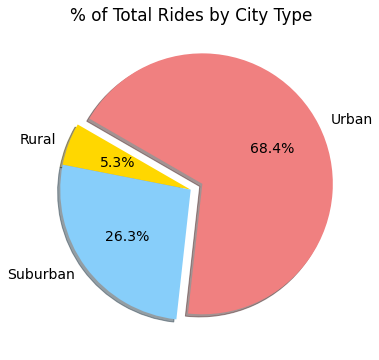
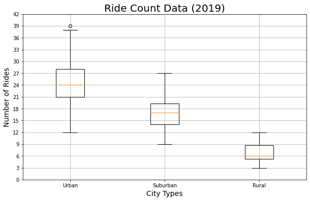

# PyBer_Analysis

## Overview of the analysis:
To analyze all the rideshare data from January to early May of 2019 and create a compelling visualization for the PyBer, CEO, V. Isualize.

## Results: 
Summary describe in Rural area with 78 drivers and total 125 rides average fare per ride is $34.62 and per driver it is $55.49 with total amount of $4327.93 during the first four months in year 2019.
In Suburban area with 490 drivers and total 625 rides average fare per ride is $30.97 and per driver it is $39.50 with total amount of $19,356.33 during the first four months in year 2019.
And in Urban area with 2,405 drivers and total 1,625 rides average fare per ride is $24.53 and per driver it is $16.67 with total amount of $39,854.38 during the first four months in year 2019.

## Summary: 
Based on the results, here are my three business recommendations to the CEO
1)	Company can increase number of drivers in Rural city. Currently in Rural city area 18 cities which is only 4 driver per cities. In Suburban city area 36 cities which is only 14 driver per cities and in Urban city area 66 cities which is only 36 driver per cities.

2)	Company can also decrease the average fare per ride in Rural city. Currently in Rural city area average fare per ride is $34.62, Suburban city area average fare per ride is $30.97 and in Urban city area average fare per ride is just $24.54, It is $10.08 difference from Rural city area fare ride.

3)	I also notice the type of ride with “NaN” counts are higher in Rural city area, and this is also one if the reason the summary shows with not much of business in first four months of year 2019. Company might see more business in remaining months.

